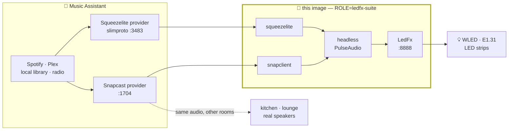

# LedFx · Snapcast · Squeezelite

> **Part of the [Home Audio Stack](https://github.com/shuricksumy/home-audio-stack)** — Music Assistant → Snapcast → PipeWire, into USB DACs, Bluetooth speakers and LED strips. That page maps how these projects fit together.

[](https://github.com/shuricksumy/ledfx-snapcast-docker/actions/workflows/build.yml)

A multi-arch (amd64/arm64) Docker image on Debian 13 (Trixie) that makes your LEDs dance to whatever [**Music Assistant**](https://www.music-assistant.io/) is playing — with no sound card, no `snd-aloop`, and nothing installed on the host.

## ✨ What you get

|  | |
| :-- | :-- |
| 💡 **The room becomes the party** | Strips and matrices react to whatever is playing anywhere in the house. |
| 🚫 **No `snd-aloop`, no sound card** | Everything happens inside the container. The host is not modified at all. |
| 🎛️ **Three roles, one image** | All-in-one visualiser, a standalone Snapserver, or a hardware ALSA player. |
| 🔌 **Both transports** | A Squeezelite player and a Snapcast client can feed it, together or separately. |

**Running more than one room?** The [Home Audio Stack](https://github.com/shuricksumy/home-audio-stack) has a [complete compose file](https://github.com/shuricksumy/home-audio-stack/tree/main/examples) with this image alongside the others.

## 🎯 Why this exists

[**Music Assistant**](https://www.music-assistant.io/) is the library and streaming brain — Spotify, Plex, local files, radio — and Home Assistant drives it. [**LedFx**](https://ledfx.app/) is the other half of the fun: it turns music into real-time effects on WLED strips and E1.31 controllers.

The problem is in between. **LedFx has to *hear* the music**, and it does that by opening an audio input device. On a headless server, or inside Docker, there is no sound card to open — so the usual advice is to load the `snd-aloop` kernel module on the host, wire an ALSA loopback, and hope the routing survives a reboot.

**This image removes that whole layer.** It runs a headless PulseAudio *inside* the container and plugs a Music Assistant player straight into it — [Squeezelite](https://github.com/ralph-irving/squeezelite), [Snapclient](https://github.com/snapcast/snapcast), or both at once. LedFx listens to that sink's monitor. The host never knows any of it is happening.



## 🖥️ Control panel

Every supervised process — PulseAudio, Snapclient, Squeezelite, LedFx — can be started,
stopped and restarted from a browser on **port 8080**, with its last 200 log lines and its
parameters editable in place. Changing a parameter restarts only the service it belongs to;
nothing here requires recreating the container.

```yaml
ports:
  - "8080:8080"     # panel
  - "8889:8888"     # LedFx's own UI
volumes:
  - ./data/ledfx-config:/config    # chown -R 1000:1000 this first
environment:
  - ADMIN_USER=admin               # optional; without ADMIN_PASSWORD the
  - ADMIN_PASSWORD=change-me       # panel is open to anyone who can reach it
```

The environment variables in your compose file **seed** `/config/services.json` on first
boot. After that the file wins, so a value you change in the panel is not reverted by a stale
compose file on the next restart — *Reset to env* in the parameters dialog goes back the other
way. Without the `/config` mount the file is written inside the container and lost on recreate.

| Variable | Description | Default |
| :--- | :--- | :--- |
| **PANEL_PORT** | Port the panel listens on | `8080` |
| **PANEL_ENABLED** | Set `false` to run headless, exactly as before the panel existed | `true` |
| **ADMIN_USER** / **ADMIN_PASSWORD** | Basic auth. No password = no auth | — |

The panel runs inside the supervisor process, so it is the services' own parent — that is what
lets it signal them. It also serves correctly behind Home Assistant Ingress, calling its API
relative to the document rather than from `/`.

It is **not a role**: it runs in all three (`ledfx-suite`, `snapserver`, `snapclient`) and drives
whatever that role already starts. Existing compose files keep working untouched — the same
environment variables produce the same command lines as before, and the panel simply goes
unpublished until you map its port.

---

## 🎛️ Use it with Music Assistant

Add the container as a player, group it with your real speakers, and the LEDs follow the house. Both routes work at the same time — pick per source, or run both and disable one.

**Squeezelite — the flexible one.** Music Assistant ships a full SlimProto implementation as its [Squeezelite provider](https://www.music-assistant.io/player-support/squeezelite/), and it renegotiates to each track's native sample rate (44.1 kHz stays 44.1 kHz). Add the provider in `SETTINGS → PLAYER PROVIDERS → ADD A NEW PROVIDER → Squeezelite`, then point this container at the MA host:

```yaml
environment:
  - ROLE=ledfx-suite
  - SQUEEZELITE_NAME=Squeez-LedFx          # the name you will see in MA
  - SQUEEZELITE_SERVER_PORT=192.168.1.50:3483   # your Music Assistant host
  - SQUEEZELITE_MAC=72:23:98:63:08:13      # fixed MAC = stable player identity
```

**Snapcast — the synchronised one.** MA's [Snapcast provider](https://www.music-assistant.io/player-support/snapcast/) ships a built-in Snapserver and keeps every room sample-accurate, at one fixed rate for all clients (48 kHz by default):

```yaml
environment:
  - ROLE=ledfx-suite
  - SNAP_HOST=192.168.1.50                 # your Music Assistant host
  - SNAP_CLIENT_ID=Snap-LedFx
```

LedFx is then on port `8888` — add your WLED devices there, pick an effect, and press play in Music Assistant.

> **If the LEDs run slightly ahead of the speakers**, that is the container's ~10 ms audio path beating a real DAC's output latency. Trim it with the per-player sync offset in Music Assistant or LMS. `PULSE_LATENCY_MSEC` controls the other direction — see [Environment Variables](#-environment-variables).

---

## ✅ Supported Roles

* **ledfx-suite**: The "All-in-One" visualizer. Runs PulseAudio, Squeezelite, Snapclient, and LedFx. Audio is routed internally via a virtual Pulse sink.
* **snapserver**: Runs a standalone Snapserver with support for Named Pipes (FIFOs).
* **snapclient**: A dedicated hardware player. Runs Snapclient with direct ALSA access for physical DACs (e.g., Topping DX5).

---

## 🔧 Environment Variables

| Variable | Description | Default |
| :--- | :--- | :--- |
| **ROLE** | `ledfx-suite`, `snapserver`, or `snapclient` | `ledfx-suite` |
| **SNAP_HOST** | IP or Hostname of the Snapserver (TCP URI handled automatically) | `127.0.0.1` |
| **SNAP_CLIENT_ID** | Unique name/ID for the Snapclient instance | `LedFx-Node` |
| **ALSA_DEVICE** | Physical device name (Used in `snapclient` role) Ex: `plughw:DX5` | `default` |
| **SNAPCLIENT_LEDFX_ENABLED** | Enable/Disable internal Snapclient in `ledfx-suite` | `true` |
| **SQUEEZELITE_LEDFX_ENABLED** | Enable/Disable internal Squeezelite in `ledfx-suite` | `true` |
| **SQUEEZELITE_NAME** | Name of the player as it appears in LMS | `LedFx` |
| **SQUEEZELITE_MAC** | Fixed MAC address for persistent LMS settings | - |
| **SQUEEZELITE_SERVER_PORT** | Direct `IP:Port` for LMS (skips discovery) | - |
| **SQUEEZELITE_OUTPUT** | PulseAudio sink for Squeezelite (`default` = server default sink) | `default` |
| **FIFO_DIR** | Directory the `snapserver` role creates its named pipes in | `/tmp` |
| **PULSE_LATENCY_MSEC** | PulseAudio buffer for clients that don't request one (Squeezelite). Also sets how granular the sink monitor LedFx reads is — PulseAudio's own default of 2000 ms leaves Squeezelite seconds behind synced players and updates the effects only ~twice a second. Raise it only if a slow host breaks the audio up | `10` |
| **EXTRA_ARGS** | Raw flags passed to the primary binary of the role (`snapserver`, `snapclient`, or `ledfx`) | - |

---

## 🔒 Running unprivileged

The container **runs as UID/GID 1000**, not root. Two things follow from that:

* Bind-mounted directories must be writable by that UID — `chown -R 1000:1000 <dir>` on the host, or override with `user: "<uid>:<gid>"` in compose.
* The LedFx config now lives at **`/home/ledfx/.ledfx`**, not `/root/.ledfx`. If you are upgrading, move the mount and chown the host directory:

```bash
sudo chown -R 1000:1000 ./ledfx_config
# volumes: - ./ledfx_config:/home/ledfx/.ledfx
```

For the `snapclient` role the image user is in the container's `audio` group (gid 29). If `/dev/snd` on your host is owned by a different gid, add it with `group_add`.

---

## ♻️ How the image stays current

Nothing is vendored in this repo. Every build resolves its dependencies fresh:

* **Snapcast** — `snapclient`/`snapserver` `.deb` packages are downloaded from the [upstream release](https://github.com/badaix/snapcast/releases) during the build and verified against the sha256 digest GitHub publishes for each asset. `--build-arg SNAPCAST_VERSION=v0.35.0` pins a specific release; the default `latest` follows upstream.
* **LedFx** — installed from PyPI; `--build-arg LEDFX_VERSION=2.0.x` pins it.
* **Squeezelite** — git submodule; the *Check and Update Submodules* workflow opens a PR when upstream moves.
* **Debian base** — the image is rebuilt every Monday, and a Trivy scan (fixable CRITICAL/HIGH only) publishes to the repository's Security tab.

---

## 📡 Case 1: LedFx Suite (The All-in-One Visualizer)

This role starts a headless PulseAudio server and routes both Squeezelite and Snapclient into it. With no sound card present PulseAudio provides a dummy sink, and LedFx listens to that sink's monitor. **No host kernel modules (snd-aloop) required.**

```yaml
services:
  ledfx_visualizer:
    image: ghcr.io/shuricksumy/ledfx-snapcast-docker:latest
    container_name: ledfx_visualizer
    restart: always
    network_mode: host
    environment:
      - ROLE=ledfx-suite
      - SNAP_HOST=192.168.111.111
      - SQUEEZELITE_NAME=LedFx-Vibe
      - SQUEEZELITE_SERVER_PORT=192.168.111.111:3483
      - SQUEEZELITE_MAC=72:23:90:63:08:66
      # Disable Squeezelite, keep Snapclient active
      - SQUEEZELITE_LEDFX_ENABLED=true
      - SNAPCLIENT_LEDFX_ENABLED=true
    user: "1000:1000"
    security_opt:
      - no-new-privileges:true
    volumes:
      - ./ledfx_config:/home/ledfx/.ledfx
```

## 📦 Case 2: Standalone Snapserver
Starts Snapserver and creates named pipes (`snapfifo` and `snapfifo_ledfx`) for external audio ingestion. They are created in `FIFO_DIR`, which defaults to `/tmp`; point it at a dedicated mounted directory so the host can write to them.

```YAML
services:
  snapserver:
    image: ghcr.io/shuricksumy/ledfx-snapcast-docker:latest
    container_name: snapcast_audio
    restart: always
    network_mode: host
    environment:
      - ROLE=snapserver
      - FIFO_DIR=/fifo
    user: "1000:1000" # chown -R 1000:1000 ${DATA_DIR}/snapserver/config
    volumes:
      - ${DATA_DIR}/snapserver/config:/config
      # Never mount over /tmp itself - the health file and PulseAudio's
      # runtime dirs live there
      - ${DATA_DIR}/snapserver/fifo:/fifo
```

## 🔈 Case 3: Hardware Player (ALSA / Direct DAC)
Recommended for Audiophile playback. Bypasses software mixers to talk directly to your hardware. Use aplay -L to find your device string.

```YAML
services:
  dx5_player:
    image: ghcr.io/shuricksumy/ledfx-snapcast-docker:latest
    container_name: snapclient_dx5
    restart: unless-stopped
    user: "1000:1000"
    devices:
      - "/dev/snd:/dev/snd"
    environment:
      - ROLE=snapclient
      - SNAP_HOST=192.168.111.111
      - SNAP_CLIENT_ID=LivingRoom-DX5
      - ALSA_DEVICE=plughw:DX5
```
